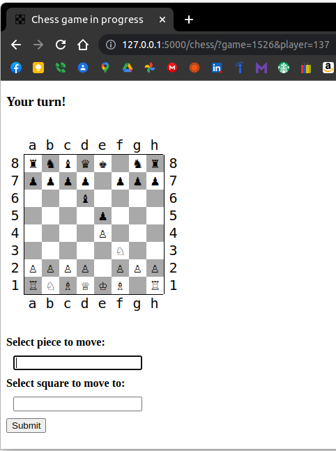

# Unicode Chess
[](https://github.com/RichardLitt/standard-readme)

This is a **Python** chess game run using [**Flask**](https://flask.palletsprojects.com/en/2.2.x/) that allows two people to play a game across the internet on their own respective browsers.  It is called "Unicode Chess" because the pieces are unicode chess characters.  Unicode characters replaced the ASCII characters of earlier versions of the game that were called "ASCII Chess."



Go to [https://chess.spiffindustries.com/](https://chess.spiffindustries.com/) to play a game!

## Table of Contents

- [Security](#security)
- [Background](#background)
- [Install](#install)
- [Usage](#usage)
- [Contributing](#contributing)
- [License](#license)

## Security

Other than the built-in security features offered by **Flask**, the communications over spiffindustries.com are secured through an SSL certificate from **Let's Encrypt**. 

## Background

This game originated as a simple **Python** program.  Communication capabilities were added to it.  Then, in an effort to demonstrate the game, it became necessary to play it through a web browser.  Thereafter, the program was re-written using **Flask** to make that possible.

## Install

If you wish to provide this product on your own server, you must clone it:

```
git clone https://github.com/rbrutherford3/Unicode-Chess.git /path/to/site/root
```
To install **Flask**, follow the instructions found [here](https://flask.palletsprojects.com/en/2.2.x/installation/).  Then go to your directory and run the app:
```
cd /path/to/site/root
export FLASK_ENV=development
flask run
```
You should see a message such as:
```
 * Environment: development
 * Debug mode: on
 * Running on http://127.0.0.1:5000/ (Press CTRL+C to quit)
 * Restarting with stat
 * Debugger is active!
 * Debugger PIN: 115-958-952
 ```
You may then go to http://127.0.0.1:5000/ (or http://localhost:5000/) on your browser to view the app.

To run this app in a production environment, you will need to use **gunicorn** and set up a `systemd` service.  Click [here](https://www.edmondchuc.com/blog/deploying-python-flask-with-gunicorn-nginx-and-systemd) for a good tutorial on how to do so.

## Usage

For the rules of chess, here is an article for beginners: https://www.chess.com/learn-how-to-play-chess

To play, you must find someone to play with and each player must be reading from the same server (i.e.: [https://chess.spiffindustries.com/](https://chess.spiffindustries.com/)).  Each will visit the site and one will commence the game.  A player code and a game code are provided to each player.  As the names suggest, the player code is unique to the player and the game code is unique to the game.  The person who starts the game will somehow have to give the other play the game code.  Once the other player enters the game code, the game begins.

The players commence by typing in location codes in "algebraic notation" (a1 or e7, for example). One location code for the starting position and one for the destination.  The page will accept input until a move is submitted, at which point the other person will be allowed to make a move.  The game is saved on the server until one of the players wins or a stalemate occurs.  Games can be bookmarked for later play.

## Contributing

Contributions are welcome, including any feedback.

## License

[MIT © Robert Rutherford](../LICENSE)
